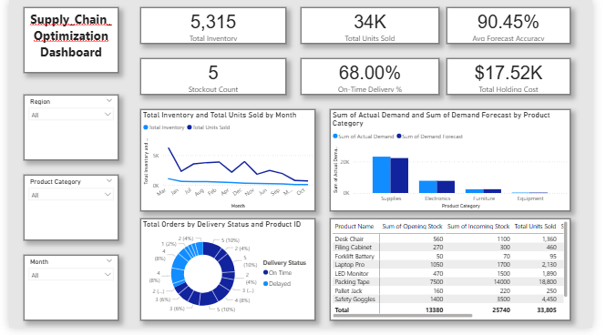

# Supply Chain Efficiency & Inventory Optimization Dashboard

## 📌 Objective
To provide a comprehensive view of inventory levels, supplier performance, and demand forecasting accuracy to help operations teams reduce stockouts and minimize holding costs.

## 🛠️ Tools Used
- **Power BI**: Data visualization and interactive dashboard creation.
- **Power Query**: Data cleaning and transformation.
- **DAX**: Custom measures for advanced KPI calculations.

## 🧮 Key DAX Measures
- `On-Time Delivery %` = DIVIDE(Count of On-Time Orders, Total Orders, 0)
- `Stockout Count` = CALCULATE(COUNTROWS(Data), Stockout Status = "Yes")
- `Total Current Inventory` = SUM(Closing Stock)

## 💡 Key Insights
1. **Supplier Performance:** Monitored delivery delays, identifying bottlenecks in specific regions.
2. **Stock Optimization:** Visualized the gap between Reorder Levels and actual Closing Stock to prevent critical stockouts.
3. **Demand Accuracy:** Tracked Actual vs. Forecasted demand to optimize future procurement planning.

## 🖼️ Dashboard Preview

## 🚀 Conclusion
This project demonstrates the ability to translate raw supply chain data into actionable operational intelligence, ensuring the right stock is available at the right time while maintaining cost efficiency.
